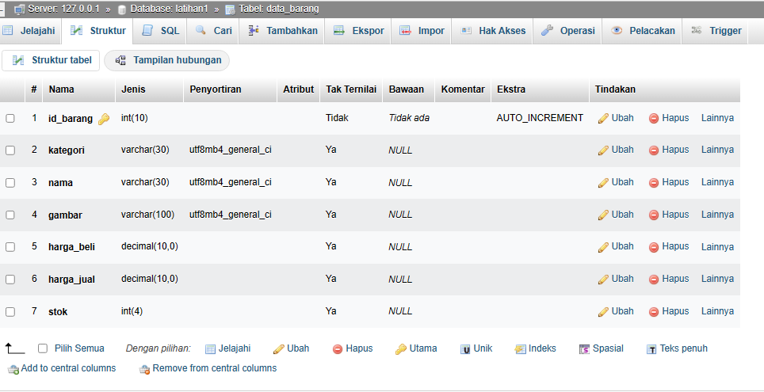
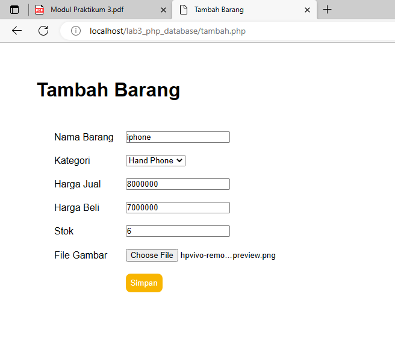
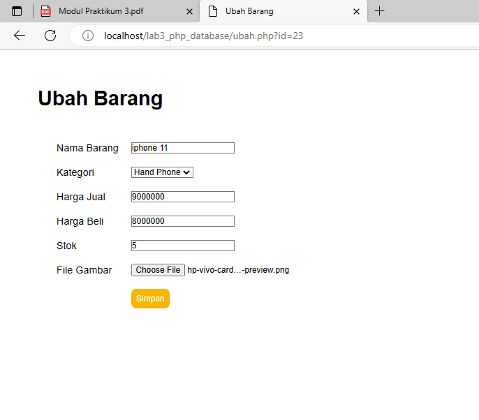

# PROJECT PRAKTIKUM 2 (PHP Dasar)

**_Nama: Mafttuhin Amanulloh_**  
**_Nim : 312110610_**  
**_Kelas : TI.21.A3_**  

 

## **Latihan 2**

### _Data Barang :_

### _Penjelasan :_

- buat lah data base dengan nama latihan1
- buat tabel dengan nama data_barang
- sesuai dengan struktur pada gambar diatas

### _strutur folder :_

### _Penjelasan :_

- buat folder lab3_php_database
- didalamnya berisi folder gambar
- file koneksi.php
- file index.php
- file hapus.php
- file tambah.php
- file ubah.php
- file style.css
- file style.fitur.css

### _Data Barang :_

- data barang menampilkan data yang ada pada database `latihan1` table `lab3_php_database` ,menampilkan gambar,data barang ,kategori,harga jual ,harga beli ,stok,dan aksi
- terdapat tiga button yaitu:
- button tambah barang untuk menambahkan data barang ,
- button ubah untuk mengubah data barang sesuai id brang,
- button hapus untuk menghapus data barang sesuai id barang
### _tambah data :_

### _ubah data :_

