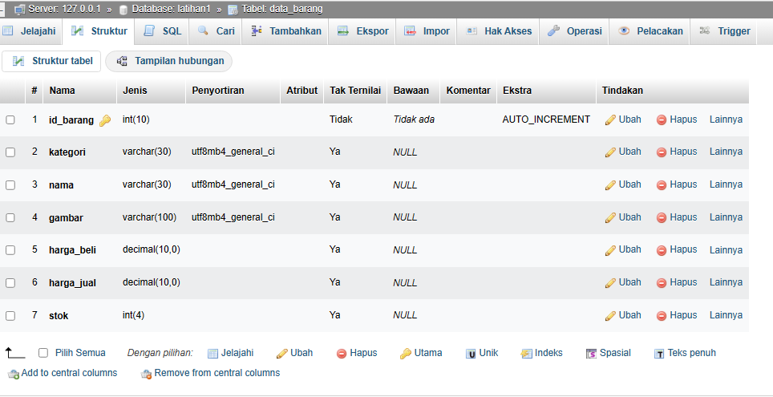

# PROJECT PRAKTIKUM 2 (PHP Dasar)

**_Nama: Mafttuhin Amanulloh_** <br/>
**_Nim : 312110610_** <br/>
**_Kelas : TI.21.A3_** <br/>

<br/>

## **Latihan 2**


### _Data Barang :_



### _Penjelasan :_

- buat lah data base dengan nama latihan1
- buat tabel dengan nama data_barang
- sesuai dengan struktur pada gambar diatas
- buatlah file koneksi.php
```php
<?php
$host = "localhost";
$user = "root";
$pass = "";
$db = "latihan1";
$conn = mysqli_connect($host, $user, $pass, $db);
if ($conn == false)
{
echo "Koneksi ke server gagal.";
die();
} #else echo "Koneksi berhasil";
?>

```

